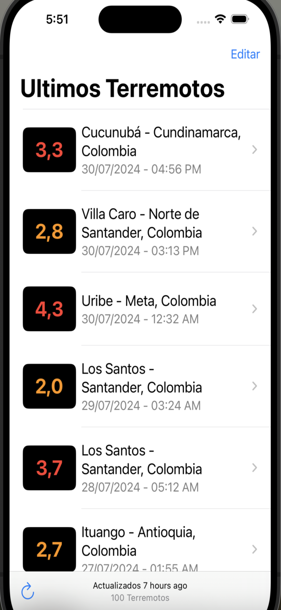
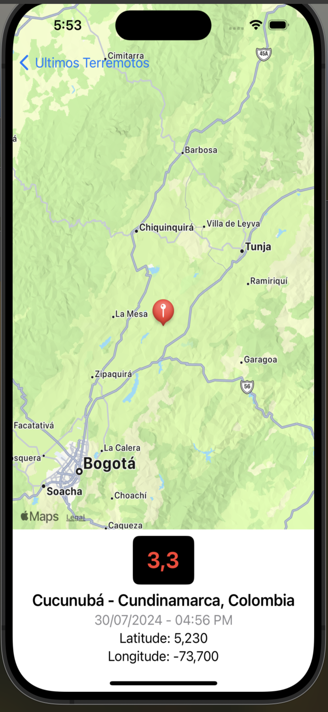

# ColombiaTerremotos.github.io
Support Page App iOS

Esta App toma los datos desde la pagina https://sismosentido.sgc.gov.co/Evaluacio nIntensidadesServlet?metodo=irASelector ,sin embargo esta app es independiente a dicha a pagina, siendo un proyecto personal de autoria de miguel bello, correo de contacto belloingmiguel@gmail.com
